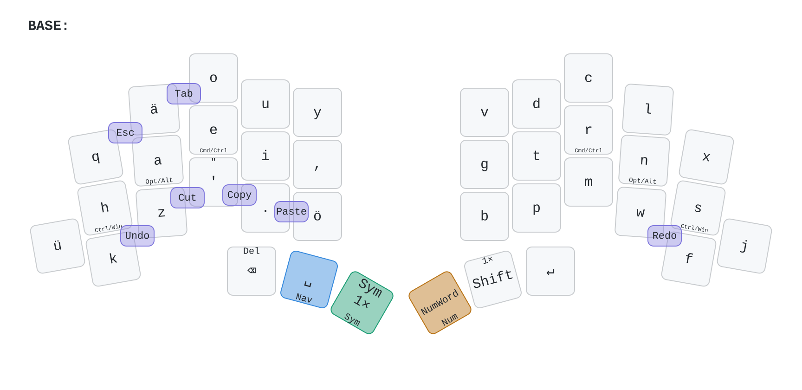
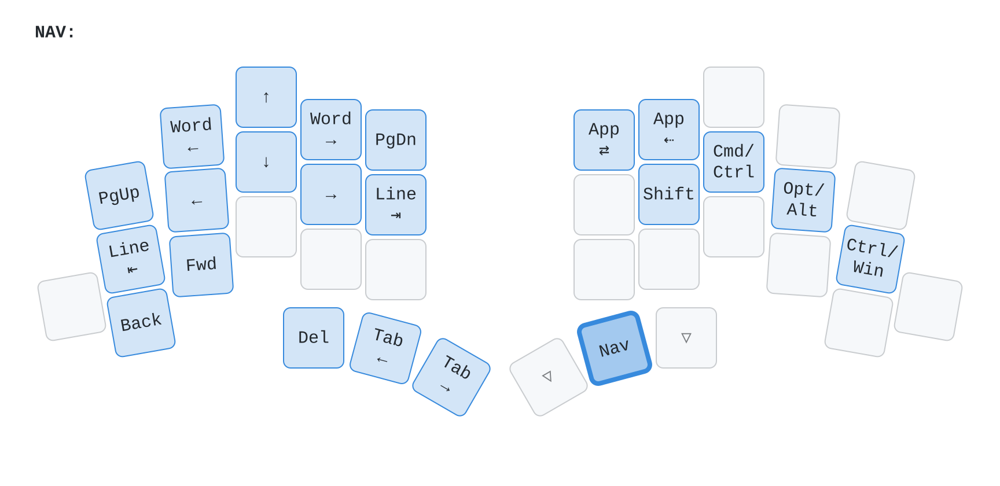
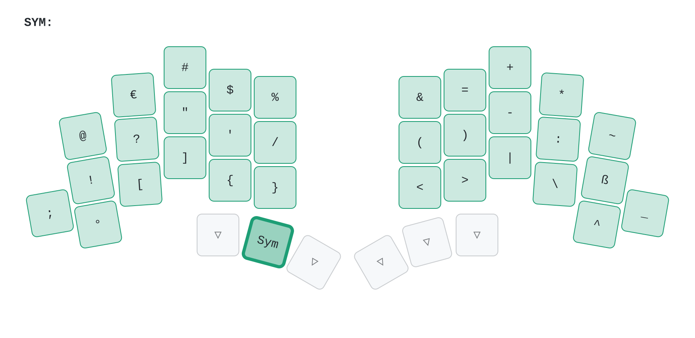
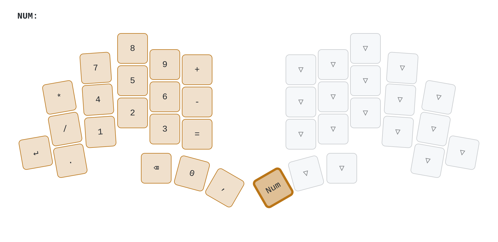
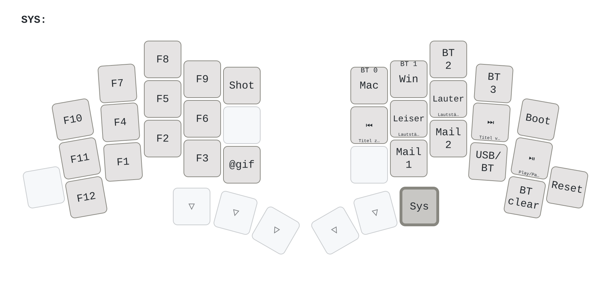
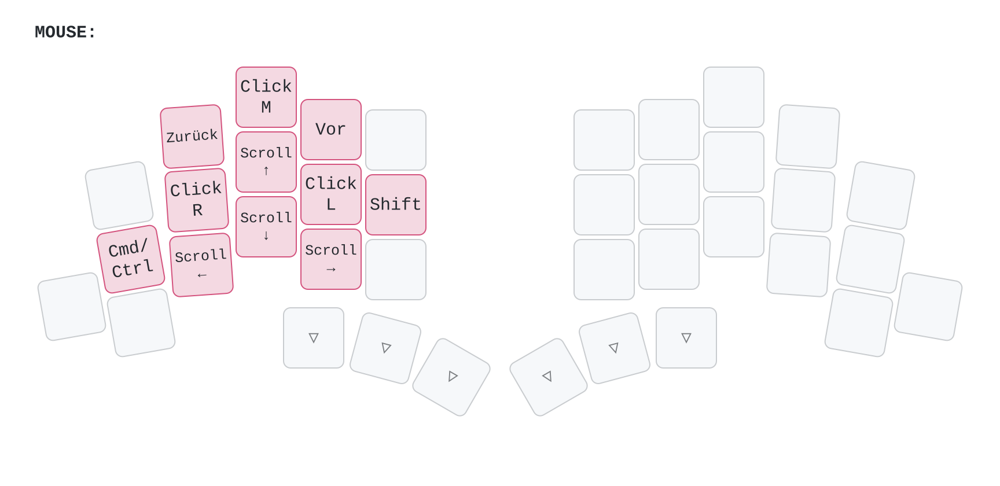

<picture>
  <source media="(prefers-color-scheme: dark)" srcset="/docs/images/TOTEM_logo_dark.svg">
  <source media="(prefers-color-scheme: light)" srcset="/docs/images/TOTEM_logo_bright.svg">
  
</picture>

# ZMK CONFIG FOR THE TOTEM SPLIT KEYBOARD

[Here](https://github.com/GEIGEIGEIST/totem) you can find the hardware files and build guide.\
[Here](https://github.com/GEIGEIGEIST/qmk-config-totem) you can find the QMK config for the TOTEM.

TOTEM is a 38 key column-staggered split keyboard running [ZMK](https://zmk.dev/) or [QMK](https://docs.qmk.fm/). It's meant to be used with a SEEED XIAO BLE or RP2040.

## Diese Konfiguration (Kurzfassung)

- Firmware: ZMK **v0.3** (fest eingestellt in `config/west.yml` und `.github/workflows/build.yml`), Modul urob/zmk-auto-layer v0.3 für Num-Word.
- Belegung: `config/totem.keymap` (anymak:END-Variante, Home-Row-Mods, Combos, Ebenen BASE/NAV/SYM/NUM/SYS/MOUSE).
- **Daumen:** links Backspace | Sym | Shift, rechts Leertaste/Nav | Num | Enter. Backspace: antippen = ⌫ (mit Shift: Entf), halten = Wort löschen, antippen und dann halten = ⌫ wiederholt.
- **Kombos:** Enter = t + r + n, Maus-Ebene an = d + c, Esc = q + ä, Tab = ä + o, Zwischenablage auf der unteren Reihe links. Auf der Maus-Ebene gelten keine Kombos.
- **Zwei Rechner, eine Belegung:** macOS ist Standard (Bluetooth-Profil 0), Windows ist ein Overlay (Profil 1). Jede Funktion liegt auf beiden Systemen auf derselben Taste.
  - Umschalten: Leertaste + Num halten (SYS-Ebene, beide mit dem rechten Daumen), dann **Mac** (rechte Hand, obere Reihe, innen) oder **Win** (daneben).
  - Nach dem Ausschalten startet die Tastatur im Mac-Modus.
- Tastencodes: `keys_de_mac.h` (macOS-Eingabequelle "Deutsch") und `keys_de_win.h` (Windows "Deutsch"). Namen nachschlagen: [docs/keycodes.md](docs/keycodes.md).
- `settings_reset`-Firmware: bei Bluetooth-Problemen auf beide Hälften flashen, danach wieder die normale Firmware.

## Belegung

Die Bilder werden bei jedem Hochladen automatisch neu gezeichnet (`keymap-drawer/draw.py`). Beschriftung von Modifiern: Mac/Windows, z. B. `Cmd/Ctrl`. Farben: Nav blau, Sym grün, Num gelb, Mouse rosa, Sys grau, Combos lila; ein dicker Rand zeigt die Taste, die die Ebene öffnet.

### Base

### Nav (Leertaste halten)

### Sym

### Num

### Sys (Leertaste + Num halten)

### Mouse (d + c gleichzeitig; jede andere Taste schaltet sie wieder aus)

## Belegung ändern

- Nur `config/totem.keymap` bearbeiten (auf github.com: Datei öffnen, Stift-Symbol, "Commit changes"). Oben in der Datei steht eine kurze Anleitung ("HOW TO EDIT").
- Jede Mac-Ebene hat eine Windows-Kopie direkt darunter (`..._win_layer`). Wer eine Taste ändert, ändert sie an derselben Stelle in der Kopie.
- Der Build prüft das zuerst (`tools/check_keymap.py`): passt eine Mac-Taste nicht zu ihrer Windows-Kopie, bricht er mit einer verständlichen Meldung ab (GitHub → Actions → "check").
- Tastennamen nachschlagen: [docs/keycodes.md](docs/keycodes.md) (z. B. § = `DE_SECT` / `DEW_SECT`).
- Die Bilder oben zeichnen sich nach jedem Hochladen selbst neu. Danach reicht es, die **linke** Hälfte zu flashen.

## HOW TO USE

- fork this repo
- `git clone` your repo, to create a local copy on your PC (you can use the [command line](https://www.atlassian.com/git/tutorials) or [github desktop](https://desktop.github.com/))
- adjust the totem.keymap file (find all the keycodes on [the zmk docs pages](https://zmk.dev/docs/codes/))
- `git push` your repo to your fork
- on the GitHub page of your fork navigate to "Actions"
- scroll down and unzip the `firmware.zip` archive that contains the latest firmware
- connect the left half of the TOTEM to your PC, press reset twice
- the keyboard should now appear as a mass storage device
- drag'n'drop the `totem_left-seeeduino_xiao_ble-zmk.uf2` file from the archive onto the storage device
- repeat this process with the right half and the `totem_right-seeeduino_xiao_ble-zmk.uf2` file.